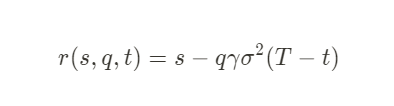
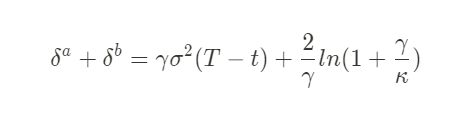

# Market Making

## HFT in a limit order book STOIKOV/AVELLANEDA
Two main risks:
 * Inventory risk, one side of the orderbook getting hit agressively and therefore accumulating risk
 * Asymmetry of information; The market maker hopes that the gains from uninformed traders will offset the losses from informed ones
### The model
Assume that market pays no interest 

### Key takeaways
Since I have no fucking clue what the math says, I looked up summaries/explenations of the paper.
 * https://medium.com/open-crypto-market-data-initiative/simplified-avellaneda-stoikov-market-making-608b9d437403
    * "To minimize inventory risk, prices should be skewed to favor the inventory to come back to its targeted ideal balance point." - Dealing with inventory risk
    * "To maximize trade profitability, spreads should be enlarged such that the expected future value of the account is maximized." - Finding the optimal bid and ask spreads

  Essentially, the problem is managing inventory (assume BTC/USD). As a MM, it's a large problem if i run out of USD inventory and is full on BTC. At this point im offsides and all I can hope for is a reversal in price to offload BTC inventory in profit. So instead of always having a static spread around mid price, adjust the spreads depending on inventory run-up. As an example: say a large buy order comes in, slams the ask side and now I have 30% in shorts and 70% usd. At this point i need to increase the spread on the ask side so that I can still fill bids but less on the ask side. The equations explain the optimal way of doing this. 

  intuitively this makes sense, the arb is still there but it'll only accept a large one, since the risk is already high, the payoff need to be good.

  * https://medium.com/hummingbot/a-comprehensive-guide-to-avellaneda-stoikovs-market-making-strategy-102d64bf5df6 

  `Reservation price:`  
  The most naive thing a market maker can do is to simply put a hardcoded symmetrical bid ask spread around mid price. This is bad since it can easily skew inventory in one direction, especially in an trending environment.  
  So to calculate the "optimal" spread we use reservation price, which is encapsulated by three factors:  
  **q measures the units away from the desired inventory**  
  **γ measure the inventory risk the system can/want to take**  
  **T-t would be the time until the trading session ends** In crypto this would be infinite since it's 24/7. Of course if it's desired then MM'ing during certain trading sessions is possible.  
  **Volatility (σ) is not an input, but rather calculated from market data**  
  

  `Bid-ask spread:`  
  The second part of the model is about finding the optimal position for the market maker orders to be placed.  
  Some factors from reservation price equation are here too (γ and (T-t)). New factors are:  
  **Order book liquidity/density (κ)**
  There is a lot of mathematical detail on the paper explaining how they arrive at this factor by assuming exponential arrival rates. There are many different models around with varying methodologies on how to calculate the value. The value of κ really refers to the amount of density/competition in the books.  
  

  where:
  s = current market mid price (mid price = the price between bid and ask, 14 bid 15 ask = 14.5 mid)
  q = quantity of assets in inventory (could be shorts or longs, just delta basically)
  σ (sigma) = market volatility 
  T = closing time, when the measurement period ends (conventiently normalized to 1)
  t = current time (T is normalized = 1, so t is a time fraction)
  δa and δb = ask and bid spread, if spread is symmetrical then δa = δb
  γ = inventory risk aversion parameter
  κ = order book liquidity paramter

  `Combining the reservation price and optimal spread`
  1. Calculate the reservation price based on target inventory
  2. Calculate the optimal bid and ask spread
  3. Create limit orders using the reservation price as reference
    * Bid = reservation price - optimal spread / 2
    * Ask = reservation price + optimal spread / 2
  
  
